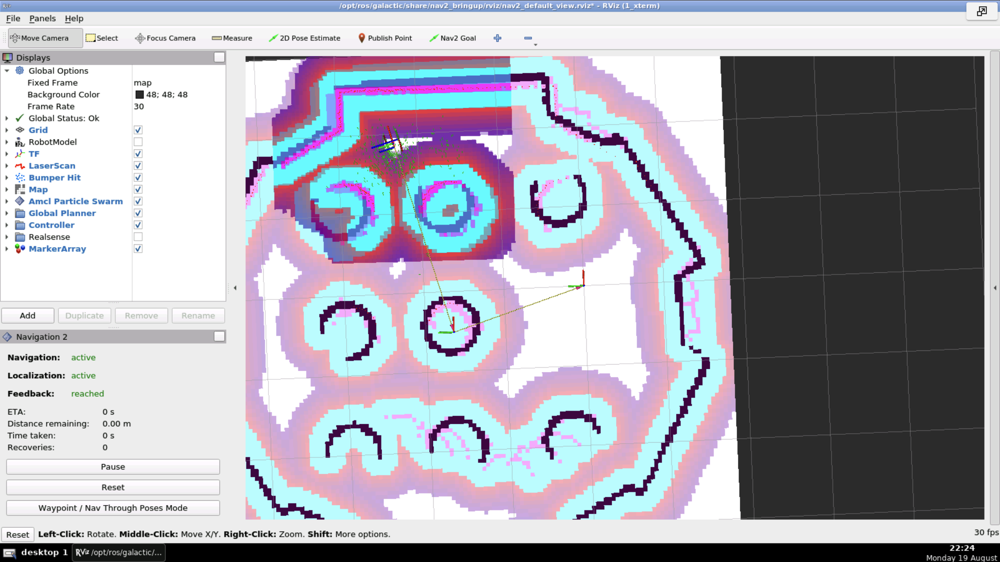

### ros2_nav_files

| Turtlebot | Colonade | Environment |
| --- | --- | --- |
|  |  |  | 

#### Build

```
source /opt/ros/galactic/setup.bash
cd ~/ros1_ws
colcon build
source install/setup.bash
```

#### Nav2 demo

1. Launch
   ```
   ros2 launch nav2_course nav2_demo.launch.py
   ```
2. Select **2D Pose Estimate**.
3. Select **Nav2 Goal**.
4. Result:
   1. Rviz2  
        
   2. TF frames  
        
   3. Gazebo  
        

#### Nav2 architecture

  


